# Enhanced Intent Graph Visualization 🎨

## Overview

The `visualize_graph` tool now generates **rich, color-coded Mermaid diagrams** with:
- 🎨 **Color-coded nodes** by type (entry, exit, processing, decision, etc.)
- 🔷 **Different shapes** for different node types
- 🔧 **Tools displayed** (MCP servers and external tools)
- 📋 **Instructions** shown inline
- ⚡ **Execution dependencies** and conditions on edges
- 🎭 **Multiple style presets** (basic, detailed, complete)

## Visual Features

### Node Types & Shapes

Each node type has a unique shape and color:

| Node Type | Shape | Color | Description |
|-----------|-------|-------|-------------|
| **Entry** | Stadium `([])` | 🟢 Green | Workflow entry points |
| **Exit** | Stadium `([])` | 🔴 Red | Workflow exit points |
| **Processing** | Rectangle `[]` | 🔵 Blue | Standard processing nodes |
| **Decision** | Diamond `{}` | 🟠 Orange | Conditional branching |
| **Aggregation** | Hexagon `{{}}` | 🟣 Purple | Data aggregation/merge |
| **Parallel** | Parallelogram `[//]` | 🟢 Teal | Parallel execution |

### Color Scheme

```
Entry:       #e1f5e1 (Light Green) with #4caf50 border
Exit:        #ffe1e1 (Light Red) with #f44336 border
Processing:  #e3f2fd (Light Blue) with #2196f3 border
Decision:    #fff3e0 (Light Orange) with #ff9800 border
Aggregation: #f3e5f5 (Light Purple) with #9c27b0 border
Parallel:    #e0f2f1 (Light Teal) with #009688 border
```

### Edge Styles

Different edge types have distinct arrow styles:

- **Sequential**: Solid arrow `--->`
- **Parallel**: Dotted arrow `-.->` 
- **Conditional**: Double arrow `==>`
- **Error/Fallback**: Dotted arrow `-.->` (red when rendered)

## Style Presets

### 1. Basic Style
**Usage:** `style: 'basic'`

Minimal visualization:
- Agent names only
- Node types
- Basic edges

**Example:**
```
Use visualize_graph with style set to 'basic'
```

### 2. Detailed Style (Default)
**Usage:** `style: 'detailed'`

Rich information:
- Agent names
- Purpose (truncated to 60 chars)
- MCP tools and external tools (up to 2 each)
- Short instructions (80 chars)
- Edge types

**Example:**
```
Use visualize_graph on the intent graph
```
(Default is `detailed`)

### 3. Complete Style
**Usage:** `style: 'complete'`

Everything:
- All features from `detailed`
- Full edge conditions
- All tools (with count if more than 2)
- Longer instructions

**Example:**
```
Use visualize_graph with style set to 'complete'
```

## Individual Options

You can override the style preset with specific options:

### `include_tools`
**Default:** `true`
**Shows:** MCP servers and external tools

```
Use visualize_graph with include_tools set to true
```

**Output Example:**
```
┌─────────────────────────────┐
│ FraudDetector               │
│ Assess fraud risk...        │
│ ────────────────────────    │
│ 🔧 Tools:                   │
│ 📡 payment-gateway-mcp/     │
│    check_fraud_score        │
│ 📡 analytics-mcp/           │
│    get_fraud_patterns       │
└─────────────────────────────┘
```

### `include_instructions`
**Default:** Enabled for `detailed` and `complete`
**Shows:** Abbreviated instructions (80 characters)

```
Use visualize_graph with include_instructions set to true
```

**Output Example:**
```
┌─────────────────────────────┐
│ PaymentProcessor            │
│ Process payment...          │
│ ────────────────────────    │
│ 📋 For orders >$500, use    │
│    authorization-capture... │
└─────────────────────────────┘
```

### `include_conditions`
**Default:** Enabled for `complete` style
**Shows:** Edge conditions and triggers

```
Use visualize_graph with include_conditions set to true
```

**Output Example:**
```
fraud_detection ==>|conditional<br/>$.risk_score > 75| manual_review
```

### `direction`
**Default:** `'TB'` (Top-Bottom)
**Options:** `'TB'` | `'LR'` (Left-Right)

```
Use visualize_graph with direction set to 'LR'
```

### `include_metadata`
**Default:** `false`
**Shows:** Graph metrics in comments

```
Use visualize_graph with include_metadata set to true
```

## Usage Examples

### Example 1: Quick Overview
```
Generate an intent graph for order processing, then visualize it with style set to 'basic'
```

**Result:** Clean diagram with just agent names and basic structure.

### Example 2: Detailed View with Tools (Recommended)
```
Generate an intent graph for order processing, then use visualize_graph
```

**Result:** Rich diagram with tools, purpose, and short instructions.

### Example 3: Complete Analysis
```
Generate an intent graph for order processing, then visualize it with style set to 'complete' and include_metadata set to true
```

**Result:** Everything - tools, full instructions, conditions, and metrics.

### Example 4: Custom Configuration
```
Visualize the graph with:
- direction: LR
- include_tools: true
- include_instructions: false
- include_conditions: true
```

**Result:** Left-to-right layout showing tools and conditions but no instructions.

## Visual Example

Here's what a node looks like in different styles:

### Basic Style


### Detailed Style

```mermaid
graph TB
  payment_node[<b>PaymentProcessor</b><br/><i>Process payment for order</i><br/>---<br/>🔧 Tools:<br/>📡 payment-gateway-mcp/authorize_card<br/>📡 payment-gateway-mcp/charge_card_immediately<br/>---<br/>📋 For orders >$500, use authorization-capture flow. For orders ≤$500...]:::processingNode
```


### Complete Style

```mermaid
graph TB
  payment_node[<b>PaymentProcessor</b><br/><i>Process payment for order</i><br/>---<br/>🔧 Tools:<br/>📡 payment-gateway-mcp/authorize_card<br/>📡 payment-gateway-mcp/capture_authorized_payment<br/>📡 payment-gateway-mcp/charge_card_immediately<br/>⚙️ tax_calculator<br/>---<br/>📋 For orders >$500, use authorization-capture flow. Orders ≤$500 charge immediately. Ensure PCI-DSS...]:::processingNode
```


## Icons Used

- 🔧 **Tools section header**
- 📡 **MCP server tools**
- ⚙️ **External tools**
- 📋 **Instructions**
- ⚡ **Conditions/triggers**

## Real-World Example

For an e-commerce order processing workflow:

```
Generate an intent graph for e-commerce order processing with validation, fraud detection, inventory, payment, and notifications.

Then visualize it with style 'complete' and direction 'LR'
```

**You'll see:**

1. **Entry Node** (🟢 Green Stadium)
   - Order intake

2. **Validation Node** (🔵 Blue Rectangle)
   - Tools: address_validator, tax_calculator, database-mcp/query_customer_profile
   - Instructions: "Validate schema, sanitize input, check business rules..."

3. **Parallel Branch** (Dotted arrows `-.->`)
   - Fraud Detection (🔵 Blue)
     - Tools: payment-gateway-mcp/check_fraud_score, analytics-mcp/get_fraud_patterns
   - Inventory Check (🔵 Blue)
     - Tools: database-mcp/get_inventory_levels, shipping_calculator

4. **Decision Node** (🟠 Orange Diamond)
   - Conditions: "risk_score > 75" → Manual Review
   - Conditions: "risk_score ≤ 75" → Payment

5. **Payment Node** (🔵 Blue Rectangle)
   - Tools: payment-gateway-mcp/* (multiple)
   - Different flows based on order amount

6. **Exit Node** (🔴 Red Stadium)
   - Order confirmation

## Benefits

### Before (Old Visualization)


### After (New Visualization)

```mermaid
graph TB
  order_validation[<b>OrderValidator</b><br/><i>Validate and sanitize order data</i><br/>---<br/>🔧 Tools:<br/>⚙️ address_validator<br/>⚙️ tax_calculator<br/>---<br/>📋 Validate schema, sanitize input, check business rules...]:::processingNode
  
  fraud_detection[<b>FraudDetector</b><br/><i>Assess fraud risk</i><br/>---<br/>🔧 Tools:<br/>📡 payment-gateway-mcp/check_fraud_score<br/>📡 analytics-mcp/get_fraud_patterns]:::processingNode
  
  order_validation --> fraud_detection
  
  classDef processingNode fill:#e3f2fd,stroke:#2196f3,stroke-width:2px
```


## Tips

1. **Start with `detailed`** (default) for most use cases
2. **Use `complete`** when debugging complex workflows
3. **Use `basic`** for presentations or high-level overviews
4. **Use `LR` direction** for wide workflows (many parallel branches)
5. **Enable `include_metadata`** to see complexity scores
6. **Combine with `include_instructions: true`** to understand what each agent does

## Limitations

- Instructions truncated to 80 characters (to keep nodes readable)
- Shows max 2 tools per type (with "+N more" indicator)
- Conditions truncated to 30 characters
- Purpose truncated to 60 characters

These limitations keep the diagrams clean while still being informative.

## Technical Details

### Mermaid Syntax Generated

```mermaid
graph TB

  node1([<b>EntryAgent</b>]):::entryNode
  node2[<b>Processor</b><br/>---<br/>🔧 Tools:<br/>📡 server/tool]:::processingNode
  node3{<b>Decision</b>}:::decisionNode
  
  node1 --> node2
  node2 ==>|conditional<br/>$.value > 10| node3
  
  classDef entryNode fill:#e1f5e1,stroke:#4caf50,stroke-width:3px
  classDef processingNode fill:#e3f2fd,stroke:#2196f3,stroke-width:2px
  classDef decisionNode fill:#fff3e0,stroke:#ff9800,stroke-width:2px
```



### Style Classes Applied

All nodes automatically get appropriate CSS classes for consistent styling across the diagram.

## Next Steps

1. **Restart Claude Desktop** to load the new visualization features
2. **Generate a graph** with your test prompt
3. **Visualize it** with different styles to see the differences
4. **Choose your preferred style** for your workflow

---

**Status:** ✅ Enhanced visualization ready
**Action Required:** Restart Claude Desktop
**Recommended:** Try `style: 'detailed'` first (it's the default!)


