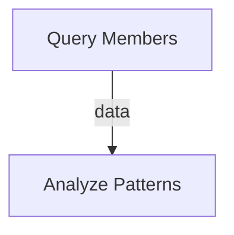

# System-Configurable Intent Graph Generation

## 🎯 Overview

The intent-graph MCP server now supports **system-specific configuration**, allowing different multi-agent systems to customize:

- ✅ **System description and purpose**
- ✅ **Custom prompt templates**
- ✅ **Output formats** (JSON, Markdown, Mermaid, custom)
- ✅ **Output schemas** (JSON Schema validation)
- ✅ **Example outputs** that work in the system's workflow
- ✅ **Agent descriptions** with capabilities and examples
- ✅ **Validation rules** specific to the system

This makes the MCP server a **universal meta-orchestration tool** that adapts to ANY multi-agent system architecture!

---

## 🏗️ Architecture

```
┌────────────────────────────────────────────────────────────┐
│           System A: Data Analytics                         │
│  ┌──────────────────────────────────────────────────────┐  │
│  │ System Config:                                       │  │
│  │ - Query/Analyst/Visualization/Quality agents         │  │
│  │ - Markdown + Mermaid output                          │  │
│  │ - Custom prompt with tables and diagrams             │  │
│  └──────────────────────────────────────────────────────┘  │
└────────────────────────────┬───────────────────────────────┘
                             ↓
┌────────────────────────────────────────────────────────────┐
│        Intent-Graph MCP Server (Meta-Orchestrator)         │
│  ┌──────────────────────────────────────────────────────┐  │
│  │ • Accepts system_configuration                       │  │
│  │ • Generates custom prompts per system                │  │
│  │ • Adapts output format to system needs               │  │
│  │ • Validates against system schema                    │  │
│  └──────────────────────────────────────────────────────┘  │
└────────────────────────────┬───────────────────────────────┘
                             ↓
┌────────────────────────────────────────────────────────────┐
│           System B: E-commerce Processing                  │
│  ┌──────────────────────────────────────────────────────┐  │
│  │ System Config:                                       │  │
│  │ - Order/Payment/Shipping/Notification agents         │  │
│  │ - JSON workflow output                               │  │
│  │ - Execution graph format                             │  │
│  └──────────────────────────────────────────────────────┘  │
└────────────────────────────────────────────────────────────┘
```

---

## 📋 System Configuration Schema

### Complete Interface

```typescript
interface SystemConfiguration {
  // System identity
  system_name?: string;
  system_description?: string;
  system_purpose?: string;
  
  // Output customization
  output_format?: "json" | "markdown" | "mermaid" | "custom";
  output_schema?: Record<string, unknown>; // JSON Schema
  
  // Prompt customization
  custom_prompt_template?: string;
  
  // Examples and documentation
  example_outputs?: Array<{
    description: string;
    output: Record<string, unknown> | string;
  }>;
  
  // Agent documentation
  agent_descriptions?: Array<{
    agent_name: string;
    description: string;
    capabilities: string[];
    example_usage?: string;
  }>;
  
  // Execution model
  execution_model?: "sequential" | "parallel" | "dag" | "custom";
  
  // Validation
  validation_rules?: string[];
}
```

---

## 🔧 How It Works

### 1. **Define Your System Configuration**

Create a configuration that describes your multi-agent system:

```json
{
  "system_configuration": {
    "system_name": "Hotel Analytics Multi-Agent System",
    "system_description": "Intent graph analyzer for hotel data analytics",
    "system_purpose": "Enable natural language queries about hotel data",
    
    "output_format": "markdown",
    "custom_prompt_template": "# Intent Graph Analyzer...",
    
    "agent_descriptions": [
      {
        "agent_name": "Query",
        "description": "SQL generation and Snowflake data retrieval",
        "capabilities": ["Generate SQL", "Execute queries", "Return dataframes"]
      }
    ],
    
    "example_outputs": [
      {
        "description": "Example: Platinum member analysis",
        "output": "## Intent Graph Analysis\n..."
      }
    ],
    
    "output_schema": {
      "type": "object",
      "properties": {
        "nodes": { "type": "array" }
      }
    }
  }
}
```

### 2. **MCP Server Builds Custom Prompts**

The server uses your configuration to build system-specific prompts:

```typescript
// In src/llm/client.ts
private buildCustomSystemPrompts(orchestrationCard, sysConfig) {
  // 1. Start with custom template
  let systemPrompt = sysConfig.custom_prompt_template;
  
  // 2. Add system context
  systemPrompt = `# ${sysConfig.system_name}
${sysConfig.system_description}
${systemPrompt}`;
  
  // 3. Add agent descriptions
  systemPrompt += `\n## Available Agents\n`;
  for (const agent of sysConfig.agent_descriptions) {
    systemPrompt += `- **${agent.agent_name}**: ${agent.description}\n`;
  }
  
  // 4. Add example outputs
  systemPrompt += `\n## Example Outputs\n`;
  // ... format examples
  
  // 5. Add output schema
  systemPrompt += `\n## Output Schema\n`;
  systemPrompt += JSON.stringify(sysConfig.output_schema);
  
  return { systemPrompt, userPrompt };
}
```

### 3. **Generate System-Specific Intent Graph**

The LLM uses your custom prompts to generate output in YOUR format:

```markdown
## Intent Graph Analysis

### Summary
Analyze spending patterns of platinum tier members...

### Intent Nodes

| Node ID | Intent | Action | Target | Agent | Dependencies |
| ------- | ------ | ------ | ------ | ----- | ------------ |
| N1 | Retrieve platinum member data | Fetch | Member data | Query | [] |
| N2 | Analyze spending patterns | Analyze | Patterns | Analyst | [N1] |

### Execution Flow

...
```

---

## 💡 Example Use Cases

### Use Case 1: Data Analytics System

**System:** Hotel analytics with Query, Analyst, Visualization, Quality agents

**Configuration:**
- Output: Markdown with Mermaid diagrams
- Schema: Node table with dependencies
- Format: Intent Graph Analysis structure

**Example:** See `example-data-analysis-system.json`

---

### Use Case 2: E-commerce Processing

**System:** Order processing with OrderValidator, PaymentProcessor, ShippingManager agents

**Configuration:**
```json
{
  "system_configuration": {
    "system_name": "E-commerce Order Processing",
    "output_format": "json",
    "custom_prompt_template": "Generate a workflow graph for order processing...",
    "output_schema": {
      "type": "object",
      "properties": {
        "workflow": {
          "type": "object",
          "properties": {
            "steps": { "type": "array" },
            "transitions": { "type": "array" }
          }
        }
      }
    }
  }
}
```

---

### Use Case 3: Customer Support System

**System:** Ticket processing with Classifier, Router, Responder agents

**Configuration:**
```json
{
  "system_configuration": {
    "system_name": "Customer Support Ticket System",
    "output_format": "json",
    "agent_descriptions": [
      {
        "agent_name": "Classifier",
        "description": "Classifies tickets into categories",
        "capabilities": ["NLP classification", "Priority detection"]
      }
    ],
    "output_schema": {
      "type": "object",
      "properties": {
        "ticket_flow": {
          "type": "array",
          "items": {
            "type": "object",
            "properties": {
              "stage": { "type": "string" },
              "agent": { "type": "string" },
              "conditions": { "type": "array" }
            }
          }
        }
      }
    }
  }
}
```

---

## 🚀 Benefits

### 1. **Standardization Across Systems**
- ✅ Common intent graph generation interface
- ✅ Consistent orchestration approach
- ✅ Shared agent architecture

### 2. **System-Specific Optimization**
- ✅ Custom output formats per system
- ✅ System-specific validation rules
- ✅ Tailored prompts for each use case

### 3. **Reusable Components**
- ✅ Share agents across systems
- ✅ Common orchestration patterns
- ✅ Portable intent graph definitions

### 4. **Flexibility**
- ✅ Adapt to ANY multi-agent architecture
- ✅ Support ANY output format
- ✅ Integrate with ANY execution engine

---

## 📝 Complete Example

See `example-data-analysis-system.json` for a full working example that demonstrates:

1. **System Configuration** for hotel analytics
2. **Custom Prompt Template** with markdown tables and Mermaid
3. **Agent Descriptions** for Query, Analyst, Visualization, Quality
4. **Example Output** showing the expected format
5. **Output Schema** for validation
6. **Validation Rules** specific to the system

---

## 🔄 Workflow

```
1. User Query
   "Show me spending patterns of platinum members"
   ↓
2. Primary Agent constructs orchestration_card with system_configuration
   ↓
3. Intent-Graph MCP Server (delegate_to_caller mode)
   ↓ Returns system-specific prompts
4. Primary Agent uses own LLM with custom prompts
   ↓ Generates intent graph in system's format
5. Output: Markdown with Intent Node table + Mermaid diagram
   ↓
6. Structured Parser (separate LLM call)
   ↓ Extracts nodes into JSON with output_schema
7. Final: Executable intent graph ready for routing
```

---

## 🎯 Key Features

### Custom Prompt Templates
Define exactly how the LLM should think about your system:

```markdown
# Intent Graph Analyzer for Multi-Agent Orchestration

You are an intent graph analyzer for [SYSTEM_NAME].

Available agents:
- **Agent1**: Description
- **Agent2**: Description

Output format:
[Your specific format here]
```

### Output Schema Validation
Ensure generated graphs match your system's requirements:

```json
{
  "type": "object",
  "properties": {
    "nodes": {
      "type": "array",
      "items": {
        "required": ["id", "agent", "intent"]
      }
    }
  }
}
```

### Example-Driven Generation
Show the LLM exactly what you want with real examples:

```json
{
  "example_outputs": [
    {
      "description": "Typical analytics query",
      "output": "## Intent Graph Analysis\n[Full example here]"
    }
  ]
}
```

---

## 🛠️ Implementation

### Files Modified

1. **`src/types.ts`** - Added `SystemConfiguration` interface
2. **`src/llm/client.ts`** - Added `buildCustomSystemPrompts()` method
3. **`src/index.ts`** - Added `system_configuration` to schema

### Code Flow

```typescript
// 1. Check for custom configuration
if (orchestrationCard.system_configuration?.custom_prompt_template) {
  return buildCustomSystemPrompts(orchestrationCard, sysConfig);
}

// 2. Use default generic prompts
return buildDefaultPrompts(orchestrationCard);
```

---

## ✅ Testing

### Test Your System Configuration

```json
{
  "orchestration_card": {
    "user_request": {
      "description": "[Your query]"
    },
    "available_agents": [...],
    "system_configuration": {
      "system_name": "Your System",
      "custom_prompt_template": "...",
      "output_schema": {...}
    }
  },
  "options": {
    "generation_mode": "delegate_to_caller"
  }
}
```

Expected result:
1. MCP server returns custom prompts based on your configuration
2. Primary agent generates intent graph in YOUR format
3. Output matches YOUR schema and validation rules

---

## 📚 Summary

The intent-graph MCP server is now a **universal meta-orchestration tool** that can adapt to ANY multi-agent system by accepting system-specific configuration. This enables:

- ✅ **Standardized intent graph generation** across different systems
- ✅ **Custom output formats** per system (Markdown, JSON, Mermaid, etc.)
- ✅ **System-specific validation** and schema enforcement
- ✅ **Reusable agent architectures** across systems
- ✅ **Example-driven generation** with system-specific prompts

**This is exactly what you requested: A flexible, system-configurable intent graph generator that adapts to your specific multi-agent orchestration needs!** 🎯🚀

